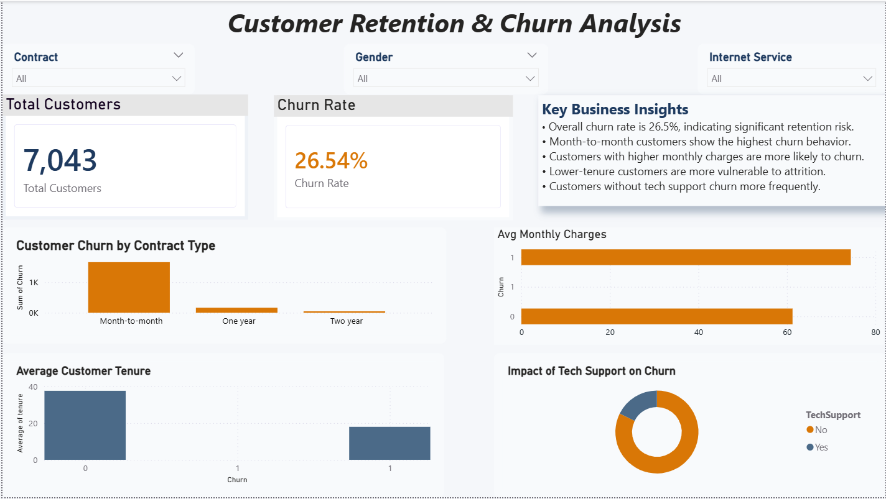

# Telecom Customer Churn Analysis | Python, SQL & Power BI

## Project Summary

Customer churn is one of the biggest business challenges for telecom companies because losing existing customers directly impacts recurring revenue, profitability, and long-term growth.

In this project, I performed an end-to-end churn analysis using Python, SQL, and Power BI to identify the major reasons customers leave the company and to generate actionable business recommendations for improving customer retention.

The project focuses not only on technical analysis, but also on translating data into meaningful business insights and decision-making strategies.

---

# Business Problem

The telecom company was experiencing significant customer churn and wanted to understand:

* Which customers are most likely to churn
* What factors contribute most to churn behavior
* Which customer segments are high-risk
* What business actions can reduce customer attrition

The goal of this analysis was to support retention-focused business decisions using data-driven insights.

---

# Dataset Information

### Dataset

IBM Telco Customer Churn Dataset

### Dataset Size

* Original Dataset: 7043 rows × 21 columns
* Cleaned Dataset: 7032 rows × 21 columns

### Target Variable

| Value | Meaning          |
| ----- | ---------------- |
| 1     | Customer Churned |
| 0     | Customer Stayed  |

---

# Tools & Technologies Used

| Tool                 | Purpose                 |
| -------------------- | ----------------------- |
| Python               | Data Cleaning & EDA     |
| Pandas               | Data Manipulation       |
| Matplotlib & Seaborn | Data Visualization      |
| MySQL                | Business Query Analysis |
| Power BI             | Dashboard Development   |
| GitHub               | Project Hosting         |

---

# Project Workflow

## 1. Data Cleaning & Preprocessing

Performed data cleaning using Python and Pandas:

* Checked missing values
* Removed duplicates
* Corrected TotalCharges datatype issues
* Converted Churn column:

  * Yes → 1
  * No → 0

One of the main challenges during preprocessing was handling datatype inconsistencies in the TotalCharges column, which initially prevented proper numerical analysis.

---

## 2. Exploratory Data Analysis (EDA)

Performed detailed analysis to understand churn behavior across different customer segments.

### Analysis Performed

* Churn Distribution
* Contract Type vs Churn
* Monthly Charges vs Churn
* Tenure vs Churn
* Tech Support vs Churn

Used:

* Seaborn
* Matplotlib
* Business-oriented visual storytelling

---

# Key Findings & Business Insights

## 1. Overall Customer Churn Rate is High

The company has an overall churn rate of approximately **26.5%**, meaning nearly 1 in 4 customers leave the company.

### Business Impact

A churn rate at this level can significantly impact recurring revenue and increase customer acquisition costs.

---

## 2. Month-to-Month Customers Represent the Highest Risk Segment

SQL and Power BI analysis showed that customers using month-to-month contracts experienced the highest churn rate (~42%).

### Business Interpretation

Customers without long-term contractual commitment are significantly more likely to leave the company.

This suggests that contract flexibility alone may not be enough to retain customers without delivering strong perceived value.

---

## 3. Higher Monthly Charges Are Associated With Higher Churn

Customers who churned had higher average monthly charges compared to retained customers.

| Customer Type      | Avg Monthly Charges |
| ------------------ | ------------------- |
| Churned Customers  | ~74                 |
| Retained Customers | ~61                 |

### Business Interpretation

Customers paying premium prices may churn if they do not perceive sufficient service value relative to cost.

---

## 4. Low-Tenure Customers Churn More Frequently

Customers with shorter tenure showed significantly higher churn behavior.

### Business Interpretation

The early customer lifecycle appears to be the most critical retention period.

This suggests onboarding experience and first-month customer satisfaction play a major role in retention.

---

## 5. Customers Without Tech Support Show Higher Churn Behavior

Customers lacking tech support services were more likely to leave the company.

### Business Interpretation

Customer support quality and accessibility may directly influence long-term customer retention.

---

# SQL Business Analysis

Business analysis was also performed using MySQL Workbench.

### SQL Concepts Used

* SELECT
* COUNT
* SUM
* AVG
* GROUP BY
* ORDER BY

### Business Queries Performed

* Total customer count
* Churn rate analysis
* Churn by contract type
* Monthly charge comparison
* High-risk customer segmentation

---

# Power BI Dashboard

An interactive Power BI dashboard was developed to present churn insights in a business-friendly and executive-level format.

## Dashboard Features

### KPI Metrics

* Total Customers
* Churn Rate

### Visualizations

* Customer Churn by Contract Type
* Average Monthly Charges by Churn
* Average Customer Tenure
* Impact of Tech Support on Churn

### Interactive Filters

* Contract Type
* Gender
* Internet Service

---

# Dashboard Preview

---

# Business Recommendations

Based on the analysis, the following retention-focused recommendations were proposed:

### Improve New Customer Onboarding

Since low-tenure customers churn more frequently, improving the first 30–90 day customer experience may significantly improve retention.

---

### Encourage Long-Term Contracts

Providing incentives for yearly and two-year contracts may reduce churn among high-risk month-to-month customers.

---

### Reevaluate Pricing Strategy

Customers with higher monthly charges showed elevated churn behavior, indicating possible pricing-value mismatch.

---

### Strengthen Tech Support Accessibility

Improving customer support responsiveness and accessibility may help reduce customer dissatisfaction and churn risk.

---

# Challenges Faced During Project

Some practical challenges encountered during the project included:

* Understanding Power BI dashboard formatting and layout design
* Fixing datatype inconsistencies in TotalCharges
* Translating raw analysis into business insights
* Designing visuals that communicate insights clearly without clutter

These challenges helped improve both technical and analytical thinking skills.

---

# Skills Demonstrated

This project demonstrates practical skills in:

* Data Cleaning
* Exploratory Data Analysis
* SQL Querying
* KPI Reporting
* Power BI Dashboarding
* Business Insight Generation
* Customer Retention Analytics
* Data Storytelling
* Business-Oriented Analytical Thinking

---

# Key Takeaway

The analysis revealed that customer churn is strongly influenced by:

* contract flexibility
* customer tenure
* pricing behavior
* support experience

The project demonstrates how data analytics can help businesses identify retention risks, understand customer behavior, and support strategic decision-making.

---

# Project Structure

Customer-Churn-Analysis/
│
├── cleaned_churn.csv
├── churn_analysis.ipynb
├── churn_queries.sql
├── Customer_Churn_Analysis.pbix
├── dashboard.png
└── README.md

---

# Future Improvements

Future enhancements planned for this project:

* Predictive churn modeling using Machine Learning
* Advanced DAX calculations in Power BI
* Customer segmentation analysis
* Interactive cloud dashboard deployment

---

# About Me

Aspiring Data Analyst focused on solving business problems using:

* Python
* SQL
* Power BI
* Data Visualization
* Business Analytics

Interested in:

* Customer Analytics
* Business Intelligence
* Data Storytelling
* Retention Analytics

---

# Connect With Me

LinkedIn: linkedin.com/in/dev-pratap-singh-33aa70393
Email: officedevpratapsingh@gmail.com
